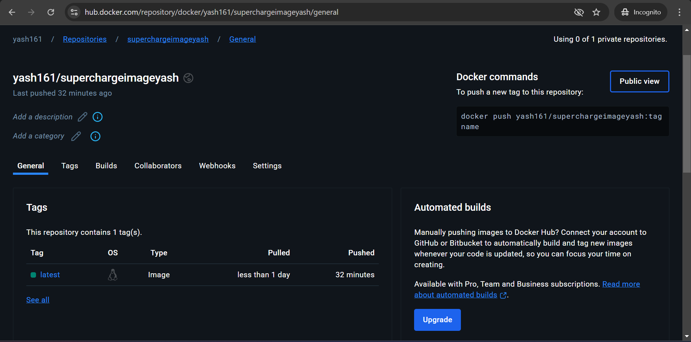

# Document Processing and Q&A System  

This project is a **Flask-based web application** that allows users to upload various types of documents (PDF, text, CSV, JSON, DOCX) and query their content. It uses **machine learning models** and **FAISS indexing** for efficient text extraction, embedding generation, and similarity search.

## Features  

- **Document Upload**: Users can upload documents.  
- **Text Extraction**: Supports multiple formats (PDF, TXT, CSV, JSON, DOCX).  
- **Embedding Generation**: Utilizes **Gemini API** for generating embeddings.  
- **FAISS Indexing**: Enables fast retrieval of similar documents.  
- **Question Answering**: Responds to user queries based on document content.  

## Technologies Used  

- **Flask** - Web framework  
- **Boto3** - AWS SDK for S3  
- **FAISS** - Efficient similarity search  
- **GeminiEmbedding** - Embedding generation from Gemini API  
- **PyMuPDF** - PDF text extraction  
- **Pandas** - Data handling (CSV files)  
- **python-docx** - DOCX text extraction  
- **Requests** - API calls to Gemini API  

## Prerequisites  

Ensure you have:  

- Python 3.12  
- Flask  
- Boto3  
- FAISS  
- PyMuPDF  
- pandas  
- python-docx  

## Installation  

1. **Clone the repository**  

    ```sh
    git clone https://github.com/yash161/superchargeplus-ai-rag-yashshah.git
    ```

2. **Navigate to the project directory**  

    ```sh
    cd superchargeplus-ai-rag-yashshah
    ```

3. **Create a virtual environment**  

    - Windows:
      ```sh
      python -m venv venv
      ```

    - macOS/Linux:
      ```sh
      python3 -m venv venv
      ```

4. **Activate the virtual environment**  

    - Windows:
      ```sh
      source venv/Scripts/activate
      ```

    - macOS/Linux:
      ```sh
      source venv/bin/activate
      ```

5. **Install dependencies**  

    ```sh
    pip install -r requirements.txt
    ```

6. **Set up AWS credentials**  

    Add `AWS_ACCESS_KEY` and `AWS_SECRET_KEY` to your environment variables or use an AWS credentials file I have added it for now.

7. **Run the Flask application**  

    ```sh
    python app.py
    ```

8. **Access the application**  

    Open your browser and go to:  
    ```
    http://127.0.0.1:8000/
    ```

---

## **Deploying with Docker and Koyeb**  

### 1. **Create a Dockerfile**  

Ensure your project has a `Dockerfile`. If not, create one in the project root:

```dockerfile
 # Stage 1: Build
FROM python:3.12 AS builder

WORKDIR /app

# Create and activate virtual environment
RUN python3 -m venv venv
ENV VIRTUAL_ENV=/app/venv
ENV PATH="$VIRTUAL_ENV/bin:$PATH"

# Install dependencies
COPY requirements.txt .
RUN pip install --no-cache-dir -r requirements.txt

# Stage 2: Run
FROM python:3.12 AS runner

WORKDIR /app

# Copy virtual environment from builder stage
COPY --from=builder /app/venv venv

# Ensure virtual environment is activated
ENV VIRTUAL_ENV=/app/venv
ENV PATH="$VIRTUAL_ENV/bin:$PATH"

# Copy application code
COPY . .

# Set environment variable for Flask app
ENV FLASK_APP=api/index.py

# Expose the application port
EXPOSE 8000

# Run Flask application
CMD ["python", "-m", "flask", "run", "--host=0.0.0.0", "--port=8000"]

```
## Docker Setup and Deployment

### 2. Build Docker Image
```sh
docker build -t your-dockerhub-username/flask-app .
```

### 3.Tag Docker Image
```sh
docker tag superchargeimageyash:latest username/superchargeimageyash:latest
```

### 4. Login to Docker Hub
```sh
docker login -u your-dockerhub-username
```

### 5.Push Docker Image to Docker Hub
```sh
docker push your-dockerhub-username/flask-app
```


### 6. Deploy on Koyeb

1. Go to [Koyeb](https://www.koyeb.com/) and sign in.
2. Click **"Create App"** → **"Deploy from Docker Image"**.
3. Enter your **Docker Image URL** (e.g., `your-dockerhub-username/flask-app`).
4. Set the **port** to `8000`.
5. Click **"Deploy"** and wait for deployment.
6. Your app will be live at the provided Koyeb URL.

Current Url-https://neighbouring-rhonda-supercharge-bad0b07c.koyeb.app/

### API Endpoints

#### Upload File
- **URL**: `/upload`
- **Method**: `POST`
- **Description**: Uploads a file to the S3 bucket.
- **Parameters**:
  - `file` (form data): The file to be uploaded.

#### Process File
- **URL**: `/process_file`
- **Method**: `POST`
- **Description**: Processes an uploaded file, retrieves similar texts, and generates a response.
- **Parameters**:
  - `file_url` (JSON): URL of the file stored in S3.
  - `query` (JSON): User query based on document content.

### Scalability & Optimization

- **Cloud Hosting**: The app is hosted on Koyeb, providing automatic scaling and handling the infrastructure seamlessly. The Docker image is deployed on Koyeb for efficient and scalable hosting.
  - **Docker**: The app is containerized using a Dockerfile, ensuring consistent environments across deployments. The Docker image is built using the following command:
    ```sh
    docker build -t your-dockerhub-username/flask-app .
    ```

  - **Koyeb Deployment**: The Docker image is deployed on Koyeb by selecting "Create App" → "Deploy from Docker Image" and configuring the app with port 8000.

- **AWS S3 Integration**: Efficient storage for large document uploads, leveraging AWS S3 for scalable file management.
- **Optimized FAISS Indexing**: High-performance similarity search using FAISS for fast and scalable document indexing.
- **Efficient API Calls**: Optimized Gemini API requests to minimize latency and ensure responsiveness even under high traffic.

